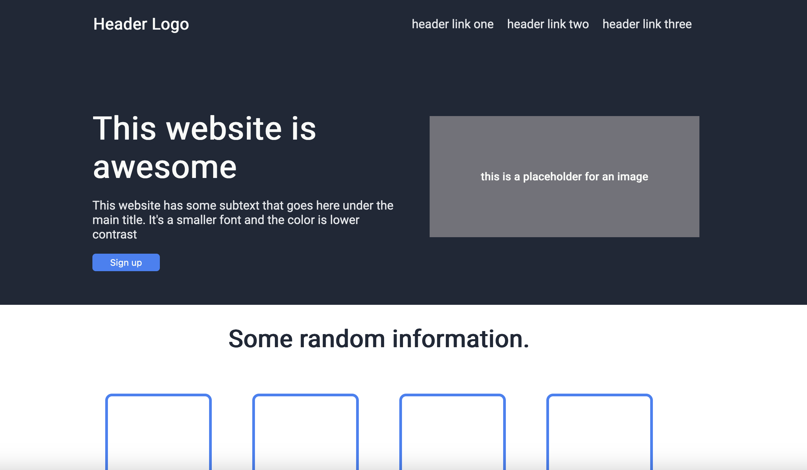

# Odin Landing Page

## Table of contents

- [Overview](#overview)
  - [Screenshot](#screenshot)
  - [Links](#links)
- [My process](#my-process)
  - [Built with](#built-with)
  - [What I learned](#what-i-learned)
  - [Continued development](#continued-development)
- [Author](#author)

## Overview

This project is my submission for the Landing Page project in the Odin Project CSS lessons.

### Screenshot

### Links

- Solution URL: [GitHub Project Page](https://github.com/micamash/odin-landing-page)
- Live Site URL: [QR Code Component](https://micamash.github.io/odin-landing-page/)

## My process

I built this product based off of the images provided by Odin Project for the finished result.

### Built with

-HTML
-CSS
-Flexbox

### What I learned
Continued development of my HTML/CSS skills.

### Continued development
I plan to continue through The Odin Project to the Javascript lessons.

## Author

- Website - [My GitHub](https://github.com/micamash)
- [The Odin Project](https://www.theodinproject.com)
